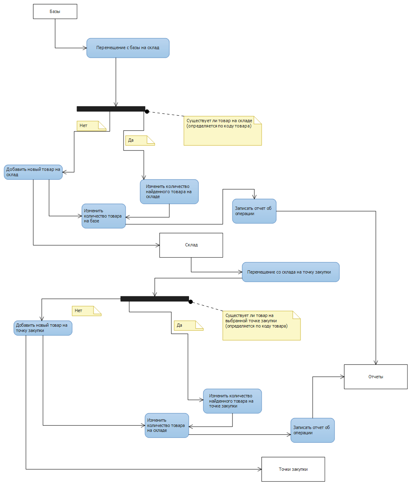

# Stock management software

This image shows the UML diagram of the main program classes of the system. From this image it is immediately evident that StockItem is the most important class in the system and is used in all its other components. Different reports are inherited from one class - StockDocument, which contains common methods for working with reports in the program.
The class that implements most of the program logic is GlobalStockApp. It contains all the methods for working with goods, moving them, writing reports and saving them to a file.

This is a high-level scheme of the program, which shows the main functionality of the program. Briefly, the goods are moved from the database to the warehouse, making a record of the report, after the goods are moved to the purchasing points and the corresponding transaction report is recorded.

This diagram shows the algorithm of the program. The three most important objects of the system are Bases, Warehouse and Purchase Points. When the goods are moved, its availability is checked on the target object. If the product exists, then we change its quantity on the target object, otherwise we create a new product with such quantity and add it to the target object. This behavior was created in order to avoid the presence of a list of identical products and add grouping of goods by code.